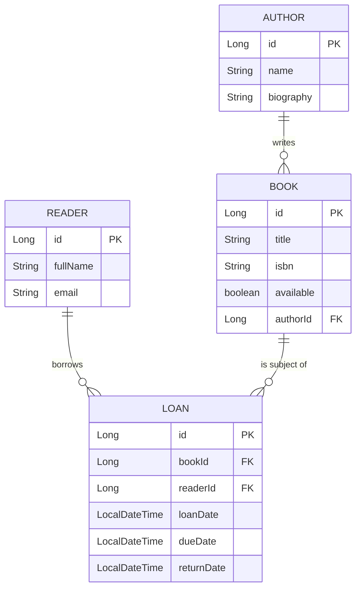

# BiblioNode - Library API

A library management system built with a layered architecture, focusing on data integrity, input validation, and comprehensive testing.

<!-- TOC -->
* [BiblioNode - Library API](#biblionode---library-api)
  * [Tech Stack](#tech-stack)
  * [Database Schema](#database-schema)
  * [Key Features](#key-features)
  * [Testing](#testing)
  * [Setup Instructions](#setup-instructions)
    * [Option 1: Quick Run (Docker only)](#option-1-quick-run-docker-only)
    * [Option 2: Development Mode (Hybrid)](#option-2-development-mode-hybrid)
    * [Cleaning up](#cleaning-up)
  * [Roadmap](#roadmap)
<!-- TOC -->

## Tech Stack
- **Language**: Java 21
- **Framework**: Spring Boot 4.0.2
- **Database**: PostgreSQL
- **Mapping**: MapStruct (Entity & DTO)
- **Documentation**: Swagger UI
- **Testing**: JUnit 5, Mockito, MockMvc

## Database Schema


## Key Features
- **Advanced Loan System**: Full lifecycle of book borrowing and returns with automated availability management and overdue tracking.
- **JPA Auditing**: Automated tracking of creation and modification timestamps for every resource using `@CreatedDate` and `@LastModifiedDate`.
- **Global Exception Handling**: Centralized error management using `@RestControllerAdvice` to ensure consistent JSON error responses across the API.
- **Validation**: Input data is strictly validated using Hibernate Validator annotations (e.g., `@NotBlank`, `@Size`) to maintain data quality.
- **Clean Architecture**: Strict separation between database entities and API response models using the DTO (Data Transfer Object) pattern.

## Testing
The project maintains a high standard of quality through different testing layers:
- **Unit Tests**: Focused on business logic within the Service layer, utilizing Mockito for dependency isolation.
- **Web Layer Tests**: Utilizing MockMvc to verify REST endpoints, HTTP status codes, JSON serialization, and validation logic without starting the full server.
- **Persistence Tests**: `@DataJpaTest` used to verify complex JPQL queries and relationship mapping.

## Setup Instructions

### Option 1: Quick Run (Docker only)
Best for quick preview. No Java/Gradle installation required.
1. **Clone the repository**:
   ```bash
   git clone https://github.com/mgrablo/BiblioNode.git
   cd BiblioNode
   ```
2. **Setup database**:
   ```bash
   docker-compose up -d
   ```
3. **Access API documentation**:

    Once the server is running, navigate to:
    `http://localhost:8080/swagger-ui/index.html`

### Option 2: Development Mode (Hybrid)
Best for making changes to the code with fast feedback

1. **Start only database**:
    ```bash
    docker-compose up -d db
    ```
2. **Start the app locally**:
   ```bash
   ./gradlew bootRun
   ```
3. **Access API documentation**:

    Once the server is running, navigate to:
   `http://localhost:8080/swagger-ui/index.html`

### Cleaning up
If you want to easily reset the database use:
```bash
docker-compose down -v
```

## Roadmap
1. [x] Basic CRUD for Books and Authors.
2. [x] Database Auditing & Pagination.
3. [x] Database Migrations with Liquibase.
4. [x] Loan System Implementation.
5. [ ] (Planned) JWT Authentication & User Roles.