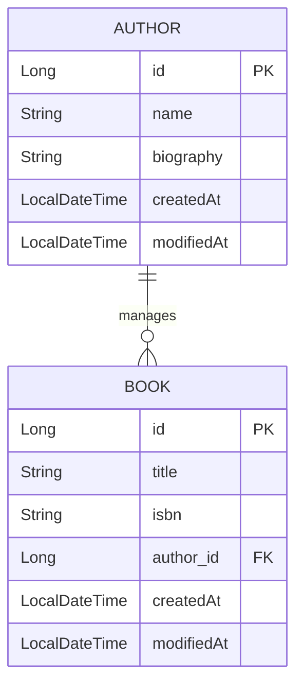

# BiblioNode - Library API

A library management system built with a layered architecture, focusing on data integrity, input validation, and comprehensive testing.

## Tech Stack
- **Language**: Java 21
- **Framework**: Spring Boot 4.0.2
- **Database**: PostgreSQL
- **Mapping**: MapStruct (Entity & DTO)
- **Documentation**: Swagger UI
- **Testing**: JUnit 5, Mockito, MockMvc

## Database Schema

## Key Features
- **JPA Auditing**: Automated tracking of creation and modification timestamps for every resource using `@CreatedDate` and `@LastModifiedDate`.
- **Global Exception Handling**: Centralized error management using `@RestControllerAdvice` to ensure consistent JSON error responses across the API.
- **Validation**: Input data is strictly validated using Hibernate Validator annotations (e.g., `@NotBlank`, `@Size`) to maintain data quality.
- **Clean Architecture**: Strict separation between database entities and API response models using the DTO (Data Transfer Object) pattern.

## Testing
The project maintains a high standard of quality through different testing layers:
- **Unit Tests**: Focused on business logic within the Service layer, utilizing Mockito for dependency isolation.
- **Web Layer Tests**: Utilizing MockMvc to verify REST endpoints, HTTP status codes, JSON serialization, and validation logic without starting the full server.

## Setup Instructions
1. **Clone the repository**:
   `git clone https://github.com/mgrablo/BiblioNode.git`
2. **Setup database**:
   `docker-compose up -d`
3. **Run the application**:
   `./gradlew bootRun`
4. **Access API documentation**:
    Once the server is running, navigate to:
    `http://localhost:8080/swagger-ui/index.html`
