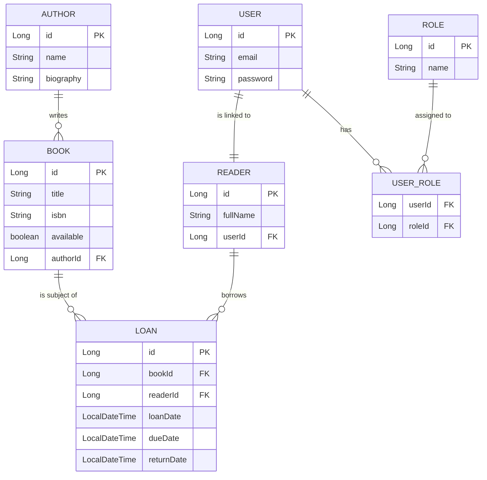

# BiblioNode - Library API

[](https://github.com/mgrablo/BiblioNode/actions/workflows/test.yml)


A library management system built with a layered architecture, focusing on data integrity, input validation, and comprehensive testing.

<!-- TOC -->
* [BiblioNode - Library API](#biblionode---library-api)
  * [Tech Stack](#tech-stack)
  * [Database Schema](#database-schema)
  * [Key Features](#key-features)
  * [Testing](#testing)
  * [Setup Instructions](#setup-instructions)
    * [Configuration](#configuration)
    * [Option 1: Quick Run (Docker only)](#option-1-quick-run-docker-only)
    * [Option 2: Development Mode (Hybrid)](#option-2-development-mode-hybrid)
    * [Access API Documentation](#access-api-documentation)
    * [Cleaning up](#cleaning-up)
  * [Roadmap](#roadmap)
<!-- TOC -->

## Tech Stack
- **Language**: Java 21
- **Framework**: Spring Boot 4.0.2, Spring Security
- **Database**: PostgreSQL
- **Mapping**: MapStruct (Entity & DTO)
- **Documentation**: Swagger UI
- **Testing**: JUnit 5, Mockito, MockMvc

## Database Schema

```mermaid
erDiagram
   AUTHOR ||--o{ BOOK : "writes"
   READER ||--o{ LOAN : "borrows"
   BOOK ||--o{ LOAN : "is subject of"
   USER ||--|| READER : "is linked to"
   USER ||--o{ USER_ROLE : "has"
   ROLE ||--o{ USER_ROLE : "assigned to"

   AUTHOR {
      Long id PK
      String name
      String biography
   }
   BOOK {
      Long id PK
      String title
      String isbn
      boolean available
      Long authorId FK
   }
   USER {
      Long id PK
      String email
      String password
   }
   ROLE {
      Long id PK
      String name
   }
   USER_ROLE {
       Long userId FK
       Long roleId FK
   }
   READER {
      Long id PK
      String fullName
      Long userId FK
   }
   LOAN {
      Long id PK
      Long bookId FK
      Long readerId FK
      LocalDateTime loanDate
      LocalDateTime dueDate
      LocalDateTime returnDate
   }
```
> **Note:** Entities `Author`, `Book`, `Loan`, `Reader`, and `User` track creation and modification timestamps (`createdAt`, `modifiedAt`) via JPA Auditing. These fields are omitted from the diagram for clarity.

## Key Features
- **Authentication & Authorization**: REST API secured with JSON Web Tokens (JWT). Role-based access control (RBAC) separating regular users and administrators.
- **Advanced Loan System**: Full lifecycle of book borrowing and returns with automated availability management and overdue tracking.
- **JPA Auditing**: Automated tracking of creation and modification timestamps for every resource using `@CreatedDate` and `@LastModifiedDate`.
- **Global Exception Handling**: Centralized error management using `@RestControllerAdvice` to ensure consistent JSON error responses across the API.
- **Validation**: Input data is strictly validated using Hibernate Validator annotations (e.g., `@NotBlank`, `@Size`) to maintain data quality.
- **API-Entity Decoupling**: Strict separation between database entities and API response models (DTOs) to ensure data security and interface stability.
- **Database Versioning**: Full schema control and versioning using Liquibase.
- **Optimized Persistence**: Utilization of JPA EntityGraphs to eliminate N+1 query problems during data retrieval, improving performance by reducing database round-trips.
- **Externalized Configuration**: Business rules (loan limits, duration) are managed via YAML profiles.

## Testing
The project maintains a high standard of quality through different testing layers:
- **Unit Tests**: Focused on business logic within the Service layer, utilizing Mockito for dependency isolation.
- **Web Layer Tests**: Utilizing MockMvc to verify REST endpoints, HTTP status codes, JSON serialization, and validation logic without starting the full server.
- **Persistence Tests**: `@DataJpaTest` used to verify complex JPQL queries and relationship mapping.
- **Code Coverage**: Automated code coverage analysis using **JaCoCo**, with reports generated for every build.
- **CI/CD Integration**: Automated test execution via GitHub Actions on every push.

## Setup Instructions

### Configuration
The application is configured using environment variables and `application.yaml` properties.

**Infrastructure & Security**

| Variable / Property         | Description                            | Default                        |
|-----------------------------|----------------------------------------|--------------------------------|
| `BD_INITIAL_ADMIN_EMAIL`    | Email for the initial admin account    | `root@biblionode.com`          |
| `BD_INITIAL_ADMIN_PASSWORD` | Password for the initial admin account | `root1234`                     |
| `RSA_PUBLIC_KEY`            | Path to RSA public key for JWT         | `file:./certs/public_key.pem`  |
| `RSA_PRIVATE_KEY`           | Path to RSA private key for JWT        | `file:./certs/private_key.pem` |
| `SPRING_PROFILES_ACTIVE`    | Active Spring profile (`dev`, `prod`)  | `prod`                         |

**Business Rules**
Can be adjusted in `application.yaml` or overridden via environment variables (e.g. `app.loan.max-active-loans` -> `APP_LOAN_MAX_ACTIVE_LOANS`).

| Property Key                        | Default | Description                     |
|-------------------------------------|---------|---------------------------------|
| `app.loan.max-active-loans`         | `5`     | Maximum active loans per reader |
| `app.loan.default-loan-days`        | `14`    | Loan duration in days           |
| `app.security.jwt-expiration-hours` | `1`     | JWT token validity (hours)      |
| `app.pagination.default-page-size`  | `20`    | Default page size for lists     |

### Option 1: Quick Run (Docker only)
Best for quick preview. No Java/Gradle installation required.

1. **Clone the repository**:
   ```bash
   git clone https://github.com/mgrablo/BiblioNode.git
   cd BiblioNode
   ```
2. **Start the application**:
   ```bash
   # Run with default 'prod' profile
   docker-compose up -d
   ```
   *Alternatively, force the 'dev' profile:*
   ```bash
   SPRING_PROFILES_ACTIVE=dev docker-compose up -d
   ```

   **Default Credentials**: See [Configuration](#configuration).
   > [!TIP]
   > You can also create a `.env` file in the root directory to set variables. Check `.env.example`.

### Option 2: Development Mode (Hybrid)
Best for making changes to the code with fast feedback.

1. **Start only database**:
    ```bash
    docker-compose up -d db
    ```
2. **Start the app locally**:
    > [!NOTE]
    > Requires JDK 21 and Gradle locally. The app will connect to the database running in Docker. Keys are generated automatically in `certs/` on first run (`dev` profile).

    Navigate to the API directory:
    ```bash
    cd biblionode-api
    ```

   ```bash
   # Linux/Mac
   SPRING_PROFILES_ACTIVE=dev ./gradlew bootRun
   
   # Windows (PowerShell)
   $env:SPRING_PROFILES_ACTIVE="dev"; ./gradlew bootRun
   ```

### Access API Documentation
Once the server is running, navigate to:
`http://localhost:8080/swagger-ui.html`

### Cleaning up
To stop containers and remove volumes (resets database):
```bash
docker-compose down -v
```

## Roadmap
1. [x] Basic CRUD for Books and Authors.
2. [x] Database Auditing & Pagination.
3. [x] Database Migrations with Liquibase.
4. [x] Loan System Implementation.
   - [x] Automatic availability management.
   - [x] Overdue tracking.
   - [x] Personal loan history for readers (`api/me/`).
5. [x] JWT Authentication & User Roles.
